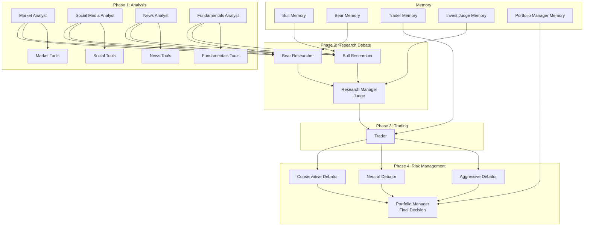
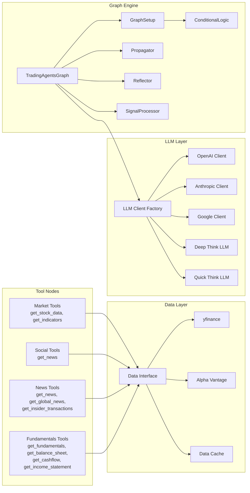
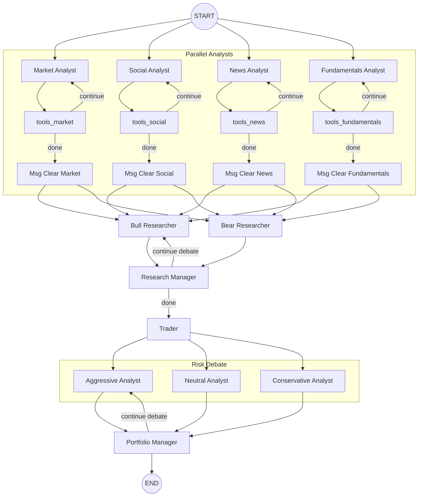

# TradingAgents -- Architecture

## System Design

TradingAgents uses LangGraph to orchestrate multiple specialized LLM agents through a directed state graph. The graph flows through four phases: analysis, research debate, trading plan, and risk evaluation.

## Trading Paradigm & Key Features

| Feature | Support | Details |
|---------|---------|---------|
| Backtesting Approach | Event-driven | Multi-day simulation via sequential `propagate()` calls; no vectorized backtesting |
| Live Trading | No | Generates BUY/SELL/HOLD signals but does not connect to brokers or execute orders |
| Paper Trading | No | No simulated execution engine |
| Multi-Asset | No | Single-stock analysis per `propagate()` call (one company at a time) |
| Data Feeds | yfinance + Alpha Vantage | Stock data, fundamentals, news, insider transactions; configurable per-tool vendor |
| ML Integration | Yes | LLM-powered agents (OpenAI, Anthropic, Google) for analysis, debate, and decision-making |
| Risk Management | Built-in | Three-perspective risk debate (aggressive, neutral, conservative) with portfolio manager final gate |
| Optimization | No | No hyperparameter or strategy optimization; debate rounds are configurable |
| Execution | None | Signal generation only (BUY/SELL/HOLD); no broker integration |

## High-Level Architecture

## Component Architecture

## LangGraph State Graph

## Key Design Patterns

### Dual LLM Strategy
The system uses two LLM tiers: a "deep thinking" model (e.g., GPT-4) for critical decisions (research judgment, portfolio management) and a "quick thinking" model (e.g., GPT-4-mini) for analysis and data processing.

### Tool-Augmented Agents
Each analyst type has a ToolNode containing data retrieval functions. The LLM agents call these tools to fetch real market data before generating their analysis.

### Debate Pattern
Both the research phase (bull vs. bear) and risk management phase (aggressive vs. conservative vs. neutral) use structured debates with configurable round limits. A judge agent synthesizes the debate into a final recommendation.

### Financial Situation Memory
Each key agent maintains a `FinancialSituationMemory` that stores past analyses and decisions. This provides context for current decisions and improves consistency.

### Configurable Data Vendors
The `src/tradingagents/dataflows/config.py` system allows switching between data vendors (yfinance, Alpha Vantage) at both category and individual tool levels, with caching to avoid redundant API calls.

## Agent Roles

| Agent | LLM Tier | Role |
|-------|----------|------|
| Market Analyst | Quick | Technical analysis with stock data and indicators |
| Social Media Analyst | Quick | Social sentiment analysis |
| News Analyst | Quick | Current affairs and insider trading analysis |
| Fundamentals Analyst | Quick | Balance sheet, cash flow, income analysis |
| Bull Researcher | Quick | Build bullish investment case |
| Bear Researcher | Quick | Build bearish investment case |
| Research Manager | Deep | Judge bull/bear debate, decide direction |
| Trader | Quick | Create actionable investment plan |
| Aggressive Debator | Quick | Risk-tolerant risk assessment |
| Neutral Debator | Quick | Balanced risk assessment |
| Conservative Debator | Quick | Risk-averse risk assessment |
| Portfolio Manager | Deep | Final trade decision incorporating risk |

---
## See Also
- [README](README.md) — Project overview and quick start
- [Workflow](workflow.md) — Event flows and processing pipelines
- [State Management](state-management.md) — State lifecycle and data models
- [Development](development.md) — Development guide and best practices
