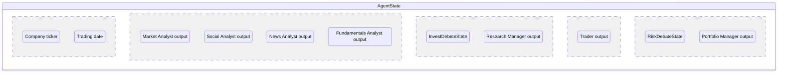
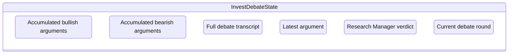
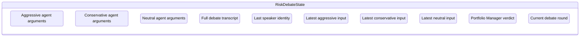
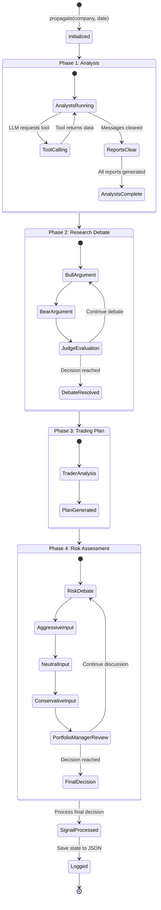
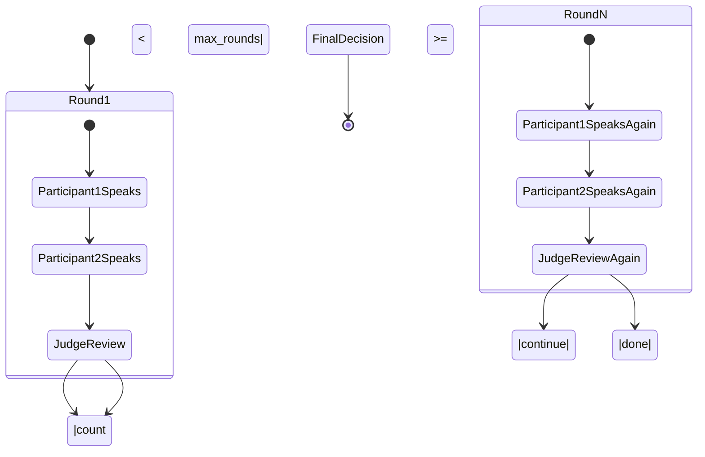
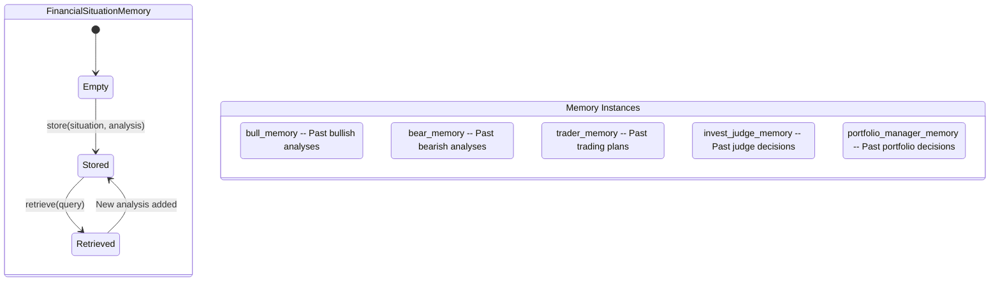

# TradingAgents -- State Management

## AgentState Structure

The core state object extends LangGraph's `MessagesState`:

## InvestDebateState

## RiskDebateState

## Pipeline State Machine

## Debate Round Control

## Memory System

Each memory instance is independent and role-specific. Memories persist across multiple `propagate()` calls, allowing agents to reference their own historical analyses.

## Configuration State

| Parameter | Default | Description |
|-----------|---------|-------------|
| `llm_provider` | `"openai"` | LLM provider (openai/anthropic/google) |
| `deep_think_llm` | `"gpt-5.4"` | Model for critical decisions |
| `quick_think_llm` | `"gpt-5.4-mini"` | Model for analysis |
| `max_debate_rounds` | `1` | Max rounds for bull/bear debate |
| `max_risk_discuss_rounds` | `1` | Max rounds for risk debate |
| `max_recur_limit` | `100` | LangGraph recursion limit |
| `output_language` | `"English"` | Output language for reports |
| `data_vendors.core_stock_apis` | `"yfinance"` | Stock data vendor |
| `data_vendors.technical_indicators` | `"yfinance"` | Indicators vendor |
| `data_vendors.fundamental_data` | `"yfinance"` | Fundamentals vendor |
| `data_vendors.news_data` | `"yfinance"` | News vendor |

## Signal Output

The `SignalProcessor` converts the portfolio manager's natural language decision into a standardized signal:

| Signal | Meaning |
|--------|---------|
| `BUY` | Strong buy recommendation |
| `SELL` | Strong sell recommendation |
| `HOLD` | Hold current position |

---
## See Also
- [README](README.md) — Project overview and quick start
- [Architecture](architecture.md) — System design and components
- [Workflow](workflow.md) — Event flows and processing pipelines
- [Development](development.md) — Development guide and best practices
