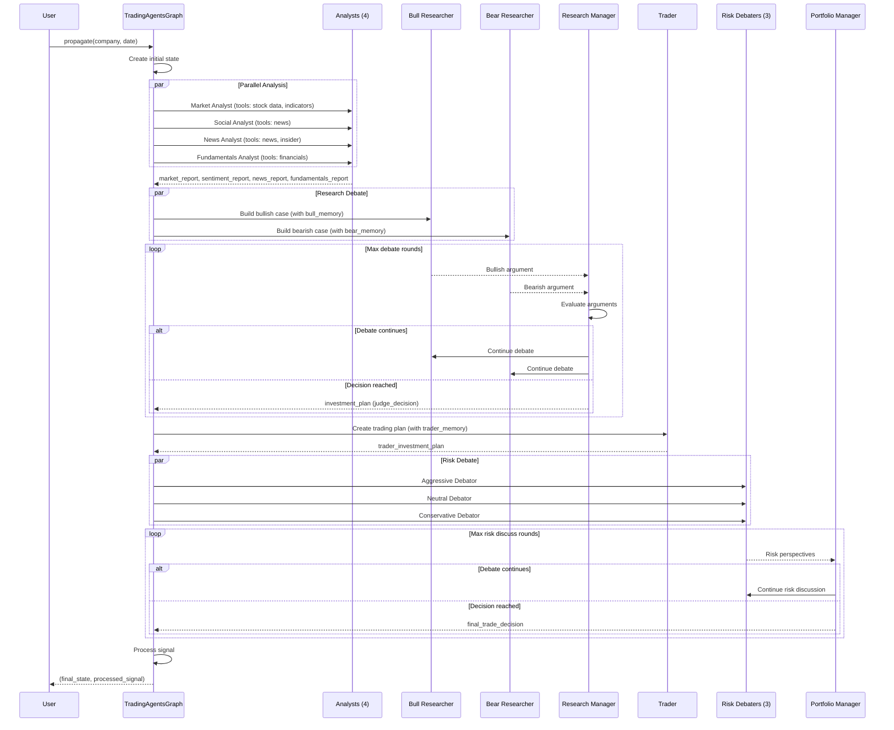
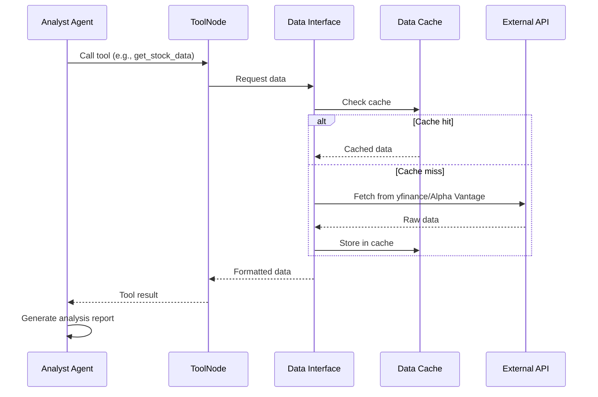
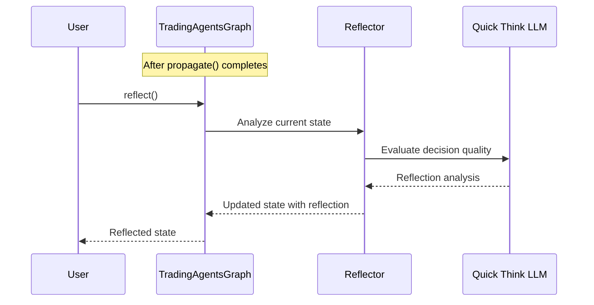
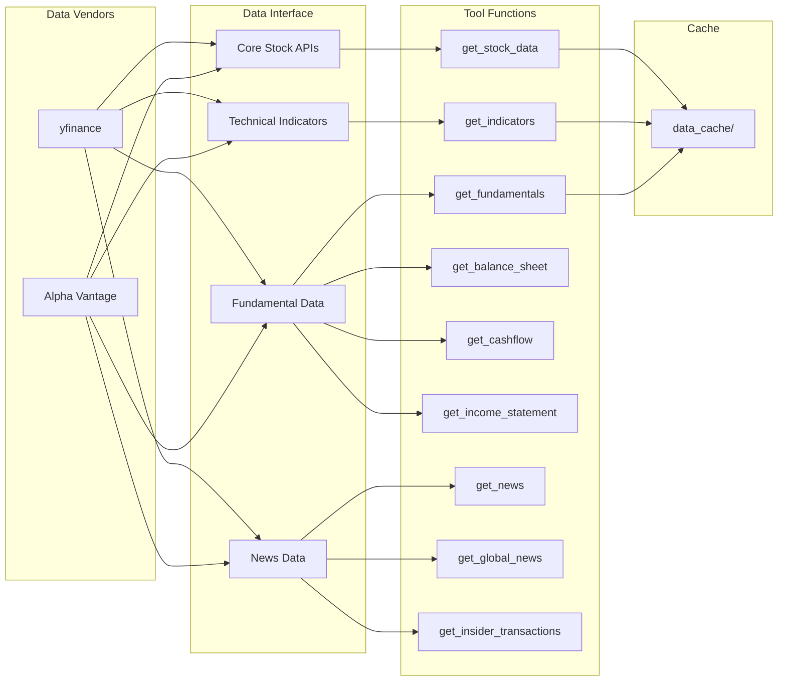
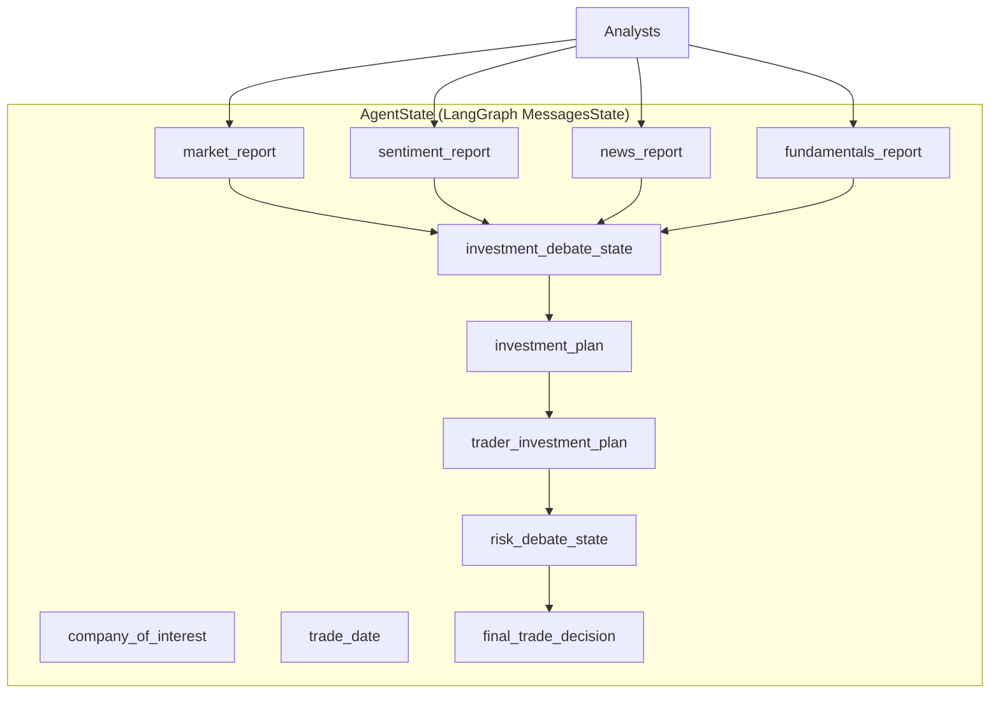
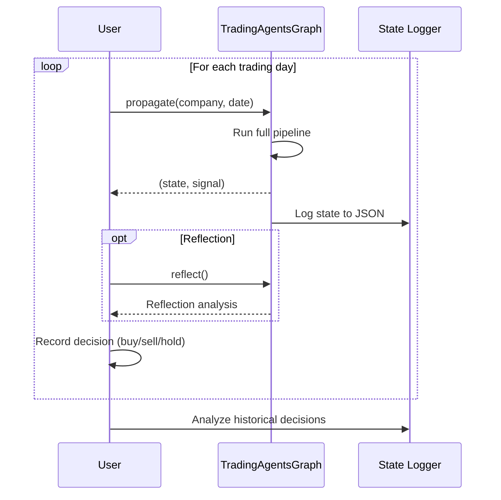

# TradingAgents -- Workflow

## Trading Decision Pipeline

## Analyst Tool Usage Flow

## Reflection Workflow

## Data Flow

## Agent State Propagation

## Multi-Day Trading Simulation

---
## See Also
- [README](README.md) — Project overview and quick start
- [Architecture](architecture.md) — System design and components
- [State Management](state-management.md) — State lifecycle and data models
- [Development](development.md) — Development guide and best practices
